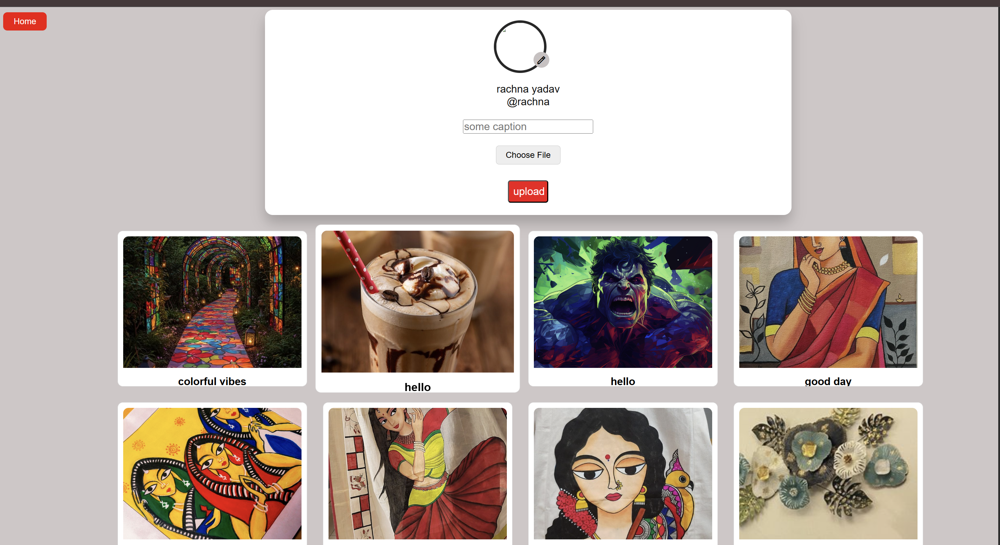

PicFlow
PicFlow is a dynamic image-sharing platform where users can register, log in, upload their own posts, view posts from others, save their favorite posts, and download images. The app provides seamless browsing and personalized profile experiences with robust user authentication.

Table of Contents
About The Project

Features

Tech Stack

Installation

Usage

Images

Contributing

License

Contact

About The Project
PicFlow enables a social platform experience centered on image sharing. Users can authenticate securely, maintain personalized profiles, explore and interact with posts, and download images they like. This project is built to enhance user engagement through a clean and responsive interface.

Features
User registration and login with secure authentication using Passport.js

Upload and share image posts

View posts from the community

Save favorite posts for easy access

Download images to local devices

Personalized profile pages with user-specific content

Smooth and responsive browsing experience

Tech Stack
Frontend: EJS templates, CSS for styling

Backend: Node.js, Express.js

Authentication: Passport.js

Database: MongoDB

Installation
Clone the repository:

bash
git clone https://github.com/RachnaCoder/Picflow.git
Navigate to the project directory:

bash
cd Picflow
Install dependencies:

bash
npm install
Setup your environment variables (e.g., MongoDB connection string, session secret) in a .env file.

Usage
Start the server:

bash
npm start
Open your browser and visit http://localhost:3000 (or the port you configured).

Register a new user, log in, and start sharing and exploring images!

Images
Here are some screenshots from the PicFlow website:

![Login Page]Screenshot 2025-09-06 180650.png)  
  
  

Created by RachnaCoder — feel free to reach out!
